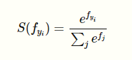
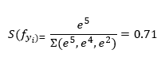
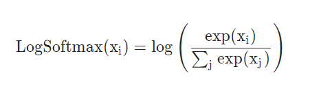
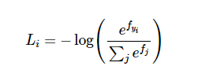
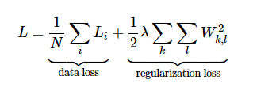
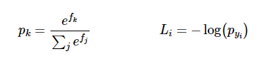
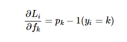

# Loss Functions in Deep Learning

I completed Calculus AB and BC during high school because I did not want to deal with mathematics during college despite loving the subject.
Somehow, the general consensus that math is hard seeped into me and I diverged from studying the subject. Little did I know that my journey into
the field of deep learning would bring me right back to driving derivatives that I enjoyed so much!

In this post, I will be doing a quick overview of loss functions used for different deep learning models. So, let's dive straight into it.

# Loss Function

Let's say we are training  an object detection model and the final output is going to look like this;
"output = C + 1 + 4" \n
C represents the different classes we are going to classify the object into \n
1 is the confidence score of whether the object belonging to that class exists in the box \n
4 is the four coordinates for the object \n

Majority of this post is going to talk about the probability output for C.
Let's say we have 3 classes to classify between, Car, Pedestrian, & Truck. The network is going to output, "[5, 4, 2]". In order to simplify this into a probability that an object belongs to a certain class, we are going to use the Softmax function: \n

The function squashes a vector of size K between 0 and 1 where K is the number of classes. So, the softmax function in our case would squash [5, 4, 2] between 0 and 1 such that the total of the output vector would equal 1. For example, the output of the application of softmax on the first class output would be: \n

In the same way, we are going to compute the probabilities for all the classes that we think the object in the bounding box belongs to, [0.71, 0.26, 0.03].
In the same way, we could use a log_softmax function to get the predicted class's log probabilities: \n

This function returns a tensor of the same dimension and shape as the input with values in the range [-inf, 0]. The log Softmax function outputs log likelihood of the softmax function, which penalizes larger error because of the exponential nature of the log softmax function. But even more important than the log likelihood is the negative log likelihood;

The softmax function inside the brackets is going to provide us with normalized 'probabilities' after doing the whole arithmetic as explained above. The reason we are using negative log likelihood is because we are trying to determine which class is correct and when the network predict a high correct class probability, the expression for Loss(i) is low and it is very high when the predicted class probability for correct class is low. Since we want the predicted 'probability' to be high, it turns out that trying to optimize the raw probability does not turn out good. So we pass in the probability to the log function and we want that output of the log(prob) to be low and that would happen if the probability is high. This makes intuitive sense because of how the negative log likelihood function works;

When we input a very small probability for the correct class label, the loss function is going toward positive infinity but when the probability for correct class label is high i.e. it goes towards 1, the loss function goes towards zero. Now we are going to look at how Loss function works,

## Cross-Entropy Loss
The Cross-entropy loss makes use of Softmax Classifier as well as regularization loss: \n

We first compute the correct log probabilities in the first half of the equation and divide them by the total number of examples. The regularization loss can be computed by multiplying regularization strength lambda with sum of W matrix squared. The final loss is going to add the data loss as well as the regularization loss.

Now that we have a way to understand the loss, we are going to look at how to optimize that loss to be the minimum via gradient descent.

## Gradient descent

In gradient descent, we are trying to minimize the loss by evaluating the gradient of the loss function with respect to parameters. In doing so, we will know how should we change the parameters to decrease the loss: \n

Let's say **p** is an intermediate variable which is a vector of normalized probabilities that we get from the softmax function. The loss function is the negative log of **p**.
In order to understand how the computed scores inside **f** should change to decrease the loss Li, we are going to derive the gradient of the loss function with respect to **f**. Since the Loss function is computed from **p** and **p** depends on **f**, we are going to make use of the loss function, compute gradient of **L** with respect to **p** and compute **p**'s gradient with respect to **f** and multiply them together. (A detailed explanation of the derivative can be found [here](https://ljvmiranda921.github.io/notebook/2017/08/13/softmax-and-the-negative-log-likelihood/).

The correct class had the probability of 0.71 in our example. According to the derivative of the gradient, we are going to get scores;
df = [-0.29, 0.26, 0.03]

Since 2nd and 3rd scores represent incorrect classes, their positive sign indicates that increasing these would lead to an increase loss. However, for the correct class label, the negative sign before 0.29 indicates that increasing the score of this class would lead to a negative influence on the loss and hence, would lower the loss. In backpropagation, that is what we are aiming for i.e. derive the gradients of the inputs on the loss function and try to minimize them for the incorrect class labels.

Hopefully, this article helped cleared out the confusion around why we use softmax and log softmax to computer the loss function and then, how to compute the gradient on those. If you want to look at the implementation of the above equations in code without using a library like PyTorch and calling the **torch.nn.CrossEntropyLoss**, [here](https://cs231n.github.io/neural-networks-case-study/#grad) is a great link.
