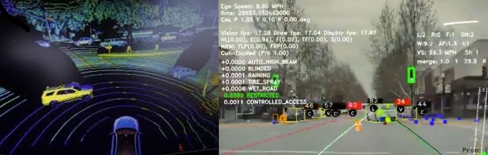

# Overview
Recent advancements in the field of Artificial Intelligence and Computer Vision have started a race among automakers and technology titans to achieve full self-driving. From Autopilot program at Tesla to Waymo by Google, Uber's and GM's teams, everyone is trying to achieve the big milestone.

All of these players face big challenges for all parts of the pipeline, from collecting data and training deep learning models to deployment on the edge. In addition, the source and type of data collection is also super important with Tesla being focused on relying on the cameras and sensors in the car versus Waymo's approach to using LIDAR for collecting points cloud data from lasers and achieving full autonomy based on that.
The following picture shows a comparison between the Waymo's approach with reliance on points cloud from LIDAR vs. Tesla's Autopilot relying on the cameras and sensors on the car:


While each of these are interesting and important problems to tackle, I chose to focus on deployment on edge. Additionally, we will also be relying on cameras and sensors data and hence, following in Autopilot's team footsteps. The reason deployment on edge is an interesting and important problem is because cars do not have the multiple GPUs that the deep learning models are trained on. For real-time inference on the road, the model needs to have the 99.9% accuracy while not compromising the speed of inference. This project was undertaken to explore this issue in more depth and come up with ways to deploy small models on edge devices that are capable of doing object detection on the road in real-time. Ideally, when the project is complete, our output is going to look something like that of Tesla's in the image above.

## Raspberry Pi 4
Our choice of edge device is a Raspberry Pi 4 with 4GB of RAM. The single board computer is compact and is strong enough for a small model to be deployed for real-time inference. We used a V2 Camera that is compatible with the Raspberry Pi and mounted it on the car's windshield for object detection on the road. While writing autonomy algorithms is outside the scope of this project since getting them to control an ICE car based on inference from the model is a challenge in itself, the project is focused on:

1. Exploration of publicly available object-detection datasets
2. Training a small model like SqueezeDet or MobileNet with SSD
3. Deployment of the model for real-time object detection


## Raspberry Pi Set-up
Depending on your vendor of choice for purchasing Raspberry Pi, it might come with NOOBS Raspbian Operating System (based on Linux) already installed on an SD card. However, to do it on your own, you can also follow the instructions here[https://projects.raspberrypi.org/en/projects/raspberry-pi-setting-up], if you are using your own or a new SD card.

## Installing Libraries
For creating the pipeline that takes in the video input from Pi Camera and passes it onto the model's object detector pipeline, we make extensive use of OpenCV, which is a powerful open source computer vision library. For the purposes of data preparation and model training for deployment, our library of choice was PyTorch. The installation instructions for both are below:

### Installing OpenCV and Other Libraries

```
# install all dependent libraries of OpenCV (yes, this is one long command)
pi@raspberrypi:~ $  sudo apt-get install libhdf5-dev -y && sudo apt-get install libhdf5-serial-dev -y && sudo apt-get install libatlas-base-dev -y && sudo apt-get install libjasper-dev -y && sudo apt-get install libqtgui4 -y && sudo apt-get install libqt4-test -y

# install OpenCV and other libraries
pi@raspberrypi:~ $ pip3 install opencv-python
Collecting opencv-python
[Omitted....]
Installing collected packages: numpy, opencv-python
Successfully installed numpy-1.16.2 opencv-python-3.4.4.19

pi@raspberrypi:~ $ pip3 install matplotlib
Collecting matplotlib
Collecting pyparsing!=2.0.4,!=2.1.2,!=2.1.6,>=2.0.1 (from matplotlib)
[Omitted...]
Successfully installed cycler-0.10.0 kiwisolver-1.1.0 matplotlib-3.0.3 numpy-1.16.3 pyparsing-2.4.0 python-dateutil-2.8.0 setuptools-41.0.1 six-1.12.0
```
In addition to OpenCV, we are also install Numpy and Matplotlib which are both super useful python modules extensively used in machine learning. You can check if the libraries have been installed but running:
```
pi@raspberrypi:~ $ python3 -c "import cv2"
pi@raspberrypi:~ $ python3 -c "import numpy"
pi@raspberrypi:~ $ python3 -c "import matplotlib"
```

Next step is installing the deep learning library of choice.

### Installing Pytorch

Our library of choice for deep learning part of the project was PyTorch, which is an open source machine learning library based on the Torch library. Now, this is not an easy task because PyTorch does not have an official PyPi package for Raspberry Pi (at least when I did it). So, there are two ways for you to go about it:

1. Compile PyTorch from source from the official Git repository: This [article](https://blog.openmined.org/federated-learning-of-a-rnn-on-raspberry-pis/) explains it in detail and walks you through the process.
2. Installing PyTorch from the pre-compiled wheel package, which is detailed [here](https://medium.com/secure-and-private-ai-writing-challenge/a-step-by-step-guide-to-installing-pytorch-in-raspberry-pi-a1491bb80531).

After you are done with following through the instructions, you can check if the library has been installed:

```
pi@raspberrypi:~ $ python3
Python 3.8.0 (default, Apr 27 2020, 17:25:39)
[GCC 6.3.0 20170516] on linux
Type "help", "copyright", "credits" or "license" for more information.
>>> import numpy
>>> import cv2
>>> import torch
```

Now that your Raspberry Pi is setup, we can dive into the essence of this project i.e. training deep learning models on object detection datasets. In the next couple of posts, we are going to explore how we tackled each of the challenges listed above.

[Part-II Model Architecture and Training](https://hira63s.github.io/2020-06-12-Tesloyta-Part-2-Model-Architecture-And-Training/)

[Part-III Model Deployment on Raspberry Pi](https://hira63s.github.io/2020-06-20-Tesloyta-Part3-Model-Deployment-On-Raspberry-Pi-For-Real-Time-Object-Detection-On-The-Road/)
