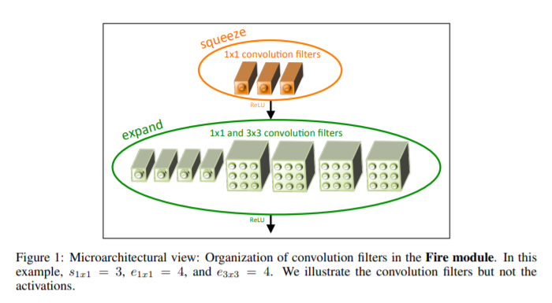
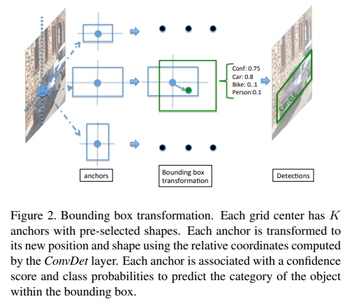

# Background

In the previous [post](https://hira63s.github.io/2020-06-06-Tesloyta-How-to-Setup-a-Raspberry-Pi-for-Real-Time-Object-Detection/), we provided the instructions on how to setup the Raspberry Pi for our deep learning project. To reiterate, we are focused on deploying an object detection model on Raspberry Pi for real-time object detection on the road. In this post, we are going to detail the KITTI dataset we trained our model on as well as the model of our choice and it's architecture. All the code and jupyter notebooks can be found in the [GitHub repo](https://github.com/Hira63S/Tesloyta).

# Dataset
We chose to use [KITTI object detection dataset](http://www.cvlibs.net/datasets/kitti/index.php) which has been used extensively in the computer vision field and a lot of SOTA models focus on maximizing the accuracy by comparing it with their benchmarks. For our purposes, we focused on 2D object detection for the time being but another model with the 3D object detection KITTI dataset is also under production and will be available soon.

# Model Architecture

One of the most important things to consider when deploying on the edge is the model size which also impacts inference speed. We chose to work with two SOTA models that were developed while keeping in mind the need to do real-time inference and not compromising speed and accuracy. We worked with [SqueezeDet](https://arxiv.org/abs/1612.01051) and [MobileNet](https://arxiv.org/abs/1704.04861) models. For object-detection with MobileNet, we used a pre-trained model with Single-Shot Detector(SSD) trained on COCO dataset and used that for our initial baseline in setting up the project.

## SqueezeDet - Fire Modules
The majority of the project, however, focuses on SqueezeDet model which is the object detection version of the SqueezeNet model. The original implementation of the model used fire modules which consist of a convolutional layer (with only 1x1 filter) and an expand layer that uses a mixture of 1x1 and 3x3 filters and concatenates the output of the layer. The reason for using a mixture of 1x1 and 3x3 filters was based on the aim of the researchers to lower the number of model parameters while not compromising on the speed and accuracy. The 1x1 filters have 9X fewer parameters than 3x3 filters and concatenating the outputs of both layers together helps us in getting feature maps that are output of a mix of filters.
Here is an image of fire module as show in the [SqueezeNet paper](https://arxiv.org/abs/1612.01051):

The SqueezeDet model starts with the input being passed into a simple convolutional layer, applying ReLU non-linearity and a pooling layer with a kernel size of 3x3. Then, we use 10 fire modules, with a pooling layer applied on the feature maps of the first two and another one applied on the feature maps output by the 3rd and 4th fire modules. After that, the number of feature maps output by the fire modules increases with the 10th fire module output of 384 feature maps from 1x1 filter and 384 feature maps output by 3x3 filter. The final step is a convolutional layer that takes in the feature map and computes bounding boxes centered around W x H uniformly distributed spatial grids. W and H represent the number of grid centers along the horizontal and vertical direction.

## ConvDet Layer
ConvDet is convolutional layer which slides through each spatial location on the feature map and at each position, it outputs K x (4 + 1 + C), where K is the number of bounding boxes with pre-selected shapes. C represents the number of classes to distinguish, 1 is for the confidence score that indicates how likely does the bounding box contain an object and 4 is for the four coordinates of the bounding box. Each position on the feature map represents a corresponding grid center in the original image.
The following image helps in visualizing how the ConvDet layer makes predictions as a convolutional layer:

Now that the Model architecture has been explained in detail (and is hopefully a bit clear :-) ), we will move onto explaining the model training and the classes we were optimizing for in the [next post](https://hira63s.github.io/2020-06-20-Tesloyta-Part3-Model-Deployment-On-Raspberry-Pi-For-Real-Time-Object-Detection-On-The-Road/).
