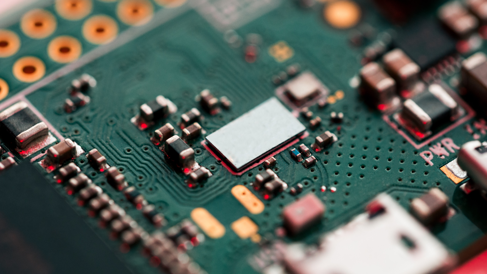

# Background
The third post in the series is focused on detailing the training process of our object detection model. The [previous post](https://hira63s.github.io/2020-06-12-Tesloyta-Part-2-Model-Architecture-And-Training/) provided a detailed overview of the architecture of the model and how it performs end-to-end object detection with a convolutional neural network.

## Data:

We are using the [KITTI Object Detection Benchmark](http://www.cvlibs.net/datasets/kitti/eval_object.php?obj_benchmark=2d), created by Andreas Geiger, Philip Lenz and Raquel Urtasun in the Proceedings of 2012 CVPR ," Are we ready for Autonomous Driving? The KITTI Vision Benchmark Suite".
There are at least 8 different classes that are labeled but in the original implementation, they only evaluated 'Car' and 'Pedestrian' classes because of the availability of enough instances for a comprehensive evaluation.

## Model:

We started with the SqueezeDet model, which has a backbone from SqueezeNet model with the last layer being a convolution layer, making it possible to do object detection without any fully-connected layers. The researchers of the SqueezeNet model were the ones who came up with SqueezeDet and first implemented it in TensorFlow. My project was majorly based off the PyTorch implementation done by Qui Jueqin and the team, [here](https://github.com/QiuJueqin/SqueezeDet-PyTorch). While majority of architecture is the same from the original implementation By Iandola and the team [here](https://github.com/BichenWuUCB/squeezeDet), there are some major changes introduced in my project.

The model was trained on the KITTI dataset and trained on a total of five classes, two of which ('Van' & 'Truck') were not included in Qui Jueqin's training of the model. The purpose of the project was not just model training but the deployment of the trained model on the raspberry pi so that we could do real-time detection on the road. So, the complicated part of the project came after the model was re-trained. In the original implementation, the trained model is provided with the parameters from epoch 280 and if you want, you could simply work with that trained model to deploy it on the Raspberry Pi. However, if you wanted to replicate the work and train your own model for the detection task with the model being able to predict more classes, the instructions to do so are provided as well.

Read the next post about the model architecture and training.
